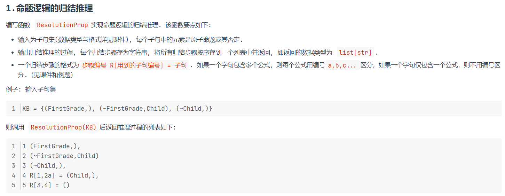
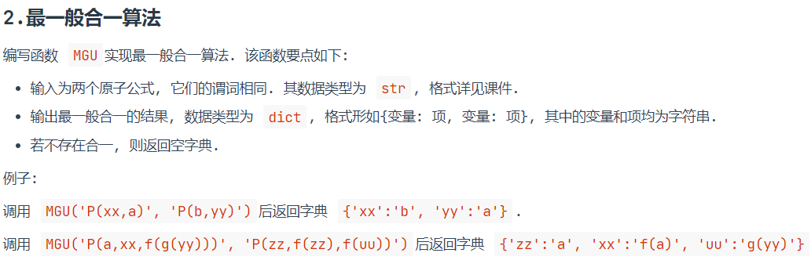
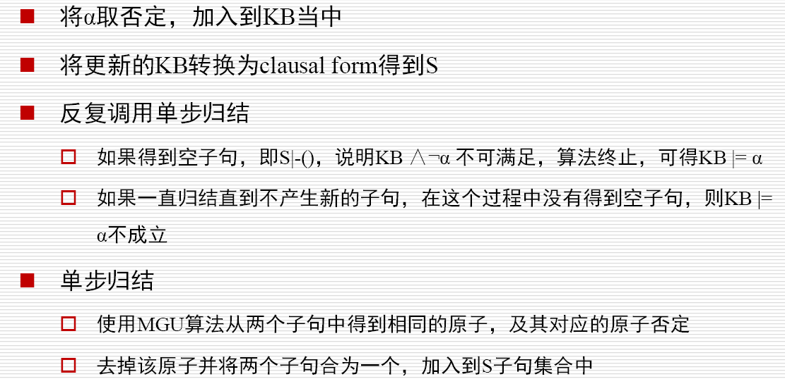

# 23336020 周子健 Week3 实验报告

## 一、实验题目

1. 命题逻辑的归结推理：

   

2. 最一般合一算法：

   

## 二、实验内容

### 1. 算法原理

+ **最一般合一算法**：

  (1) 合一子（Unifier）：一个替换 $\sigma$，使得对表达式 $E_1$ 和 $E_2$，有
  $$
  E_1 \sigma = E_2 \sigma
  $$
  (2) 最一般合一子（MGU）:如果存在合一子 $\sigma$，且对任意其他合一子 $\theta$，都存在替换 $\lambda$ 使得 $\theta = \sigma \circ \lambda$，则σ是MGU。

  (3) 算法步骤：

  1. $k = 0, \sigma_0 = \{\}, S_0 = {f, g}$

  2. 如果 $S_k$ 中两个公式等价，返回 $\sigma_k$ 作为最一般合一的结果；否则找出 $S_k$ 中的不匹配项 $D_k = \{ e_1, e_2 \}$

  3. 如果 $e_1 = V$ 是变量，$e_2 = t$ 是一个不包含变量 $V$ 的项，将 $V=t$ 添加到赋值集合 $\sigma_{k+1}=\sigma_k \cup \{V=t\}$；并将 $S_k$ 中的其它 $V$ 变量也赋值为 $t$，得到 $S_{k+1}$；令 $k=k+1$，转到第二步。

     否则合一失败

+ **归结算法**：

  

### 2. 关键代码展示

#### MGU

### 3. 创新点 & 优化

## 三、实验结果及分析

### 1. 实验结果展示实力

### 2. 评测指标展示及分析

## 四、参考资料

