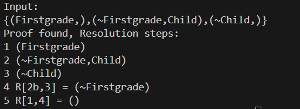

# 23336020 周子健 Week3 实验报告

## 一、实验题目

1. 命题逻辑的归结推理：

   

2. 最一般合一算法：

   

## 二、实验内容

### 1. 算法原理

+ **最一般合一算法**：

  (1) 合一子（Unifier）：一个替换 $\sigma$，使得对表达式 $E_1$ 和 $E_2$，有
  $$
  E_1 \sigma = E_2 \sigma
  $$
  (2) 最一般合一子（MGU）:如果存在合一子 $\sigma$，且对任意其他合一子 $\theta$，都存在替换 $\lambda$ 使得 $\theta = \sigma \circ \lambda$，则σ是MGU。

  (3) 算法步骤：

  1. $k = 0, \sigma_0 = \{\}, S_0 = {f, g}$

  2. 如果 $S_k$ 中两个公式等价，返回 $\sigma_k$ 作为最一般合一的结果；否则找出 $S_k$ 中的不匹配项 $D_k = \{ e_1, e_2 \}$

  3. 如果 $e_1 = V$ 是变量，$e_2 = t$ 是一个不包含变量 $V$ 的项，将 $V=t$ 添加到赋值集合 $\sigma_{k+1}=\sigma_k \cup \{V=t\}$；并将 $S_k$ 中的其它 $V$ 变量也赋值为 $t$，得到 $S_{k+1}$；令 $k=k+1$，转到第二步。

     否则合一失败

+ **归结算法**：

  

### 2. 关键代码展示

#### MGU

+ 在 MGU 函数中，首先对待合一公式进行解析，然后再进行合一算法：

  ```python
  def MGU(str1, str2):
      """Main function for Most General Unifier.
      Args:
          str1: str, term 1
          str2: str, term 2
      Returns:
          dict, variable name -> Term
          str, unified term
      """
      term1 = parse_term(str1)
      term2 = parse_term(str2)
      sigma = unify(term1, term2)
      if sigma is None:
          return None
      term1 = apply_subst(term1, sigma)
      term2 = apply_subst(term2, sigma)
      assert term1.__repr__() == term2.__repr__()
      return sigma, term1.__repr__()
  ```

+ 合一算法中，递归地对公式进行合一，每次从公式对集合中 `pop` 出一对公式进行合一：

  + 如果同为函数（或谓词），则首先对比函数名以及参数数量是否相同，如果相同则将函数拆分并成对加入集合中；否则合一失败
  + 如果一个是变量，则首先判断是否在另一项中出现 (`occurs`)，之后将变换对加入变换对集合中，并对公式对集合和变换对集合中所有公式应用

  ```python
  def unify(t1, t2):
      """Most General Unifier
      Args:
          t1: Term
          t2: Term
      Returns:
          dict, variable name -> Term
          or None if unification fails
      """
      # equations: list of pairs of terms
      equations = [(t1, t2)]
      # sigma: dict, variable name -> Term
      sigma = {}
  
      while equations:
          s, t = equations.pop(0)
          # 对 s 和 t 应用当前的替换 sigma
          s = apply_subst(s, sigma)
          t = apply_subst(t, sigma)
          
          if s == t:
              continue
          elif isinstance(s, Variable):
              if occurs(s, t, sigma):
                  return None
              # place s with t
              sigma[s.name] = t
              equations = [(apply_subst(l, {s.name: t}), apply_subst(r, {s.name: t})) for l, r in equations]
              # update sigma
              sigma = {var: apply_subst(term, {s.name: t}) for var, term in sigma.items()}
          elif isinstance(t, Variable):
              # symmetric case
              if occurs(t, s, sigma):
                  return None
              sigma[t.name] = s
              equations = [(apply_subst(l, {t.name: s}), apply_subst(r, {t.name: s})) for l, r in equations]
              sigma = {var: apply_subst(term, {t.name: s}) for var, term in sigma.items()}
          elif isinstance(s, Function) and isinstance(t, Function):
              if s.name != t.name or len(s.args) != len(t.args):
                  return None
              else:
                  # add sub-equations
                  equations = list(zip(s.args, t.args)) + equations
          else:
              # not match
              return None
      return sigma
  ```

#### 归结算法

+ **单步归结**：

  单步归结中，枚举字句的项并尝试合一，如果合一成功，则返回编号，变换集和合一后的项

  ```python
  def resolve(C1: list, C2: list) -> list:
      """Resolve two clauses C1 and C2.
      Args:
          C1: list of str
          C2: list of str
      Returns:
          tuple, (int, int, dict, list)
          or None if cannot resolve
      """
      for i, l in enumerate(C1):
          for j, r in enumerate(C2):
              if is_diff(l, r):
                  mgu_result = MGU(to_pos(l), to_pos(r))
                  if mgu_result is None:
                      continue
                  sigma, term = mgu_result
  
                  def apply_sigma(lit: str) -> str:
                      sign = '~' if is_neg(lit) else ''
                      return sign + repr(apply_subst(parse_term(to_pos(lit)), sigma))
                  C1 = [apply_sigma(lit) for lit in C1]
                  C2 = [apply_sigma(lit) for lit in C2]
                  if term in C1 and to_neg(term) in C2:
                      C1.remove(term)
                      C2.remove(to_neg(term))
                  else:
                      C1.remove(to_neg(term))
                      C2.remove(term)
                  resolvent = []
                  [resolvent.append(l) for l in C1 if l not in resolvent]
                  [resolvent.append(r) for r in C2 if r not in resolvent]
                  return i, j, sigma, resolvent
      return None
  ```

+ 归结算法：

  ```python
  def ResolutionProp(KB: str):
      """Resolution for propositional logic.
      Args:
          KB: str, knowledge base
      Returns:
          list of dict, steps of resolution
      """
      clauses = kb2list(KB)
      steps = [{'parents': None, 'clauses': None, 'sigma': None,
                'resolvent': clause} for clause in clauses]
      while True:
          new_steps = []
          for i in range(len(steps)):
              for j in range(i + 1, len(steps)):
                  C1 = steps[i]['resolvent']
                  C2 = steps[j]['resolvent']
                  res = resolve(C1, C2)
                  if res is None:
                      continue
                  k1, k2, sigma, resolvent = res
                  if resolvent in [step['resolvent'] for step in steps]:
                      continue
  
                  new_step = {
                      'parents': [i, j],
                      'clauses': [chr(k1 + 97) if len(C1) > 1 else '',
                                  chr(k2 + 97) if len(C2) > 1 else ''],
                      'sigma': sigma,
                      'resolvent': resolvent
                  }
                  new_steps.append(new_step)
  
                  if resolvent == []: # Find resolution
                      # Backtrace to find all steps involved in the proof
                      steps.append(new_step)
                      empty_index = len(steps) - 1
                      chain_indices = set(range(len(clauses)))
                      backtrace(steps, empty_index, chain_indices)
                      chain_indices = sorted(chain_indices)
                      proof_steps = [steps[idx] for idx in chain_indices]
  
                      # Change parent index
                      for step in proof_steps:
                          if step['parents'] is not None:
                              step['parents'] = [
                                  chain_indices.index(p) for p in step['parents']]
  
                      return proof_steps
          steps.extend(new_steps)
          if not new_steps:
              return None
  ```

### 3. 创新点 & 优化

无

## 三、实验结果及分析

### 1. 实验结果展示示例

#### MGU


#### 归结推理



### 2. 评测指标展示及分析

无

## 四、参考资料

+ 实验课文档
+ 参考课本
