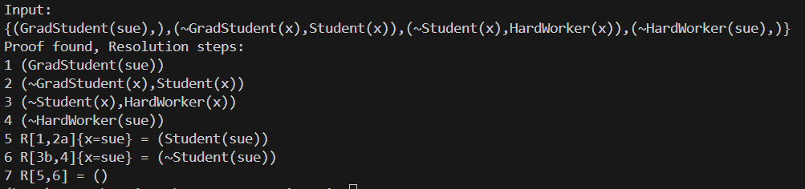
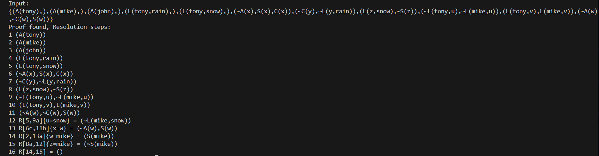
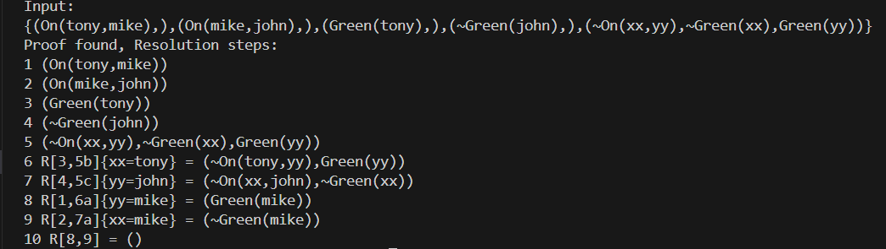
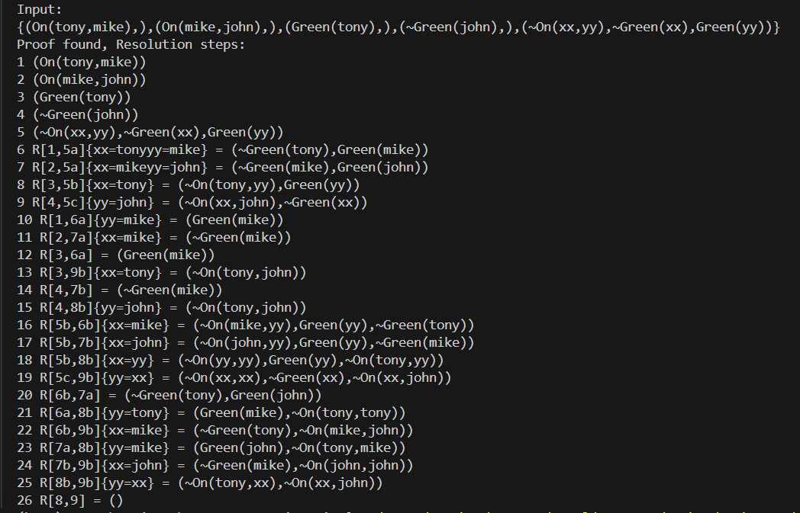

# 23336020 周子健 Week3 实验报告

## 一、实验题目

+ 实现包含谓词与函数的字句集的归结推理

## 二、实验内容

### 1. 算法原理

+ **最一般合一算法**：

  (1) 合一子（Unifier）：一个替换 $\sigma$，使得对表达式 $E_1$ 和 $E_2$，有
  $$
  E_1 \sigma = E_2 \sigma
  $$
  (2) 最一般合一子（MGU）:如果存在合一子 $\sigma$，且对任意其他合一子 $\theta$，都存在替换 $\lambda$ 使得 $\theta = \sigma \circ \lambda$，则σ是MGU。

  (3) 算法步骤：

  1. $k = 0, \sigma_0 = \{\}, S_0 = {f, g}$

  2. 如果 $S_k$ 中两个公式等价，返回 $\sigma_k$ 作为最一般合一的结果；否则找出 $S_k$ 中的不匹配项 $D_k = \{ e_1, e_2 \}$

  3. 如果 $e_1 = V$ 是变量，$e_2 = t$ 是一个不包含变量 $V$ 的项，将 $V=t$ 添加到赋值集合 $\sigma_{k+1}=\sigma_k \cup \{V=t\}$；并将 $S_k$ 中的其它 $V$ 变量也赋值为 $t$，得到 $S_{k+1}$；令 $k=k+1$，转到第二步。

     否则合一失败

+ **归结算法**：

  

### 2. 关键代码展示

+ 由于谓词和函数带来的嵌套关系较为复杂，直接使用字符串判断将会导致代码复杂化，同时给编写带来极大困难
+ 通过定义 `Term` 基类和 `Variable`, `Constant`, `Function` 等子类，对字句进行解析，以实现更为灵活的字句操作，简化归结算法的实现

```python
VARIABLES = {'u', 'v', 'w', 'x', 'y', 'z', 'uu', 'vv', 'ww', 'xx', 'yy', 'zz'}

# Term class and its subclasses
class Term:
    def __init__(self):
        pass

    def __eq__(self, other):
        raise NotImplementedError

    def __repr__(self):
        raise NotImplementedError

class Variable(Term):
    def __init__(self, name):
        self.name = name

    def __eq__(self, other):
        return isinstance(other, Variable) and self.name == other.name

    def __repr__(self):
        return self.name

class Constant(Term):
    def __init__(self, name):
        self.name = name

    def __eq__(self, other):
        return isinstance(other, Constant) and self.name == other.name

    def __repr__(self):
        return self.name

# All functions and predicates are represented as Function
class Function(Term):
    def __init__(self, name, args):
        self.name = name
        self.args = args  # list of Terms

    def __eq__(self, other):
        return (isinstance(other, Function) and 
                self.name == other.name and 
                len(self.args) == len(other.args) and
                all(a == b for a, b in zip(self.args, other.args)))

    def __repr__(self):
        return f"{self.name}(" + ",".join(repr(arg) for arg in self.args) + ")"

# Paser: parse string to term
def parse_term(s):
    # remove spaces
    s = s.replace(" ", "")
    index = 0

    def parse():
        nonlocal index
        # read identifier consisting of characters
        start = index
        while index < len(s) and s[index].isalpha():
            index += 1
        name = s[start:index]
        # if the next character is '(', it is considered a function/predicate
        if index < len(s) and s[index] == '(':
            index += 1  # skip '('
            args = []
            while True:
                args.append(parse())
                if index < len(s) and s[index] == ',':
                    index += 1  # skip ','
                elif index < len(s) and s[index] == ')':
                    index += 1  # skip ')'
                    break
                else:
                    break
            return Function(name, args)
        # the identifier is considered a variable if in VARIABLES, otherwise treated as a constant
        return Variable(name) if name in VARIABLES else Constant(name)
    
    return parse()
```

### 3. 创新点 & 优化

+ 使用类管理字句中的项，简化代码编写，提高代码灵活性。

+ 归结推理中，如果将所有推理步输出，会输出许多实际不在归结过程中的推理步，导致输出过长；

  优化：记录推理步的“父亲”步，推理成功后，由最终步回溯推理过程，最终只输出有用的推理步，极大的精简了输出

  ```python
  def backtrace(steps, index, chain):
      """
      递归回溯步骤链，将产生空子句证明过程中涉及的步骤索引加入 chain 集合中。
      """
      if index in chain:
          return
      chain.add(index)
      if steps[index]['parents'] is not None:
          for parent in steps[index]['parents']:
              backtrace(steps, parent, chain)
  ```

## 三、实验结果及分析

### 1. 实验结果展示示例







### 2. 评测指标展示及分析

+ 如果不进行回溯推理，直接输出所有推理步，则将导致推理步过多，如

  

  以及另一个测例输出了102步。

+ 但进行回溯推理后，推理步输出分别变为了 10 步和 17 步。

## 四、参考资料

+ 实验课文档
+ 参考课本
