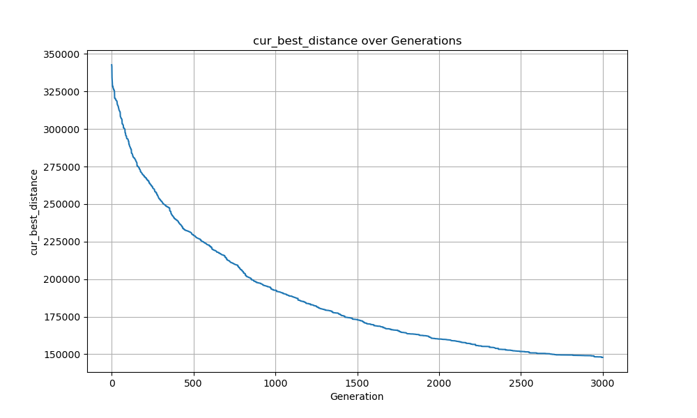

# 23336020 周子健 Week5 实验报告

本次实验提交目录如下：

```
23336020_周子健_第五周作业
- week5.pdf
- code/
	- week5-1/  # A*算法
		- week5-1.py
		- output/
			- output_0_MD.txt
			- output_1_LC.txt
			# ...
    - week5-2/  # IDA*算法
    	- week5-2.py
    	- output/
    		- output_0.txt
    		- output_0_LC.txt
    		# ...
    - week5-3/  # GA算法
    	- week5-3.py
    	- config.yaml
    - requirements.txt  # 本次作业依赖文件
```

## 一、实验题目

+ 使用启发式搜索算法 A* 和 IDA* 解决15-Puzzle问题
+ 利用遗传算法求解TSP问题

## 二、实验内容

### 1. 算法原理

+ **A star算法**：

  定义起点 $s$，终点 $t$，从起点（初始状态）开始的距离函数 $g(x)$，到终点（最终状态）的距离函数 $h(x), h^*(x)$，其中 $h(x)$ 为启发式函数，$h^*(x)$ 为实际的距离，以及每个点的估价函数 $f(x)=g(x)+h(x)$

  A* 算法每次从优先队列中取出一个 $f$ 最小的元素，然后更新相邻状态。

  对于启发式函数 $h$：

  + 如果 $h \leq h^*$，则 A* 算法能找到最优解
  + 上述条件下，如果 $h$ 满足三角不等式，则 A* 不会将重复结点加入队列
  + 当 $h=0$ 时，A* 算法变为 Dijkstra；当 $h=0$ 且边权为 1 时变为 BFS

+ **IDA star 算法**：

  IDA* 为采用了迭代加深算法的 A* 算法，相对于 A* 算法，优缺点如下：

  1. 不需要判重，不需要排序，利于深度剪枝。
  2. 空间需求减少：每个深度下实际上是一个深度优先搜索，不过深度有限制，使用 DFS 可以减小空间消耗。
  3. 重复搜索：即使前后两次搜索相差微小，回溯过程中每次深度变大都要再次从头搜索。

  伪代码：

  ```c
  Procedure IDA_STAR(StartState)
  Begin
    PathLimit := H(StartState) - 1;
    Succes := False;
    Repeat
      inc(PathLimit);
      StartState.g = 0;
      Push(OpenStack, StartState);
      Repeat
        CurrentState := Pop(OpenStack);
        If Solution(CurrentState) then
          Success = True
        Elseif PathLimit >= CurrentState.g + H(CurrentState) then
          For each Child(CurrentState) do
            Push(OpenStack, Child(CurrentState));
      until Success or empty(OpenStack);
    until Success or ResourceLimtsReached;
  end;
  ```

+ **遗传算法**：

  1. 选择初始生命种群

  2. 评价种群中的个体适应度
  3. 以比例原则选择产生下一个种群（轮盘法，竞争法）
  4. 交叉和变异
  5. 重复2-4步直到停止循环的条件满足

  利用遗传算法解决TSP问题伪代码
  
  

### 2. 关键代码展示

#### 启发式搜索

+ 为了简化与统一算法代码，首先定义 `Node` 类，实现状态的创建、扩展、格式化输出等：

  ```python
  class Node:
      target = tuple([
          (1, 2, 3, 4),
          (5, 6, 7, 8),
          (9, 10, 11, 12),
          (13, 14, 15, 0)
      ])
  
      directions = [
          (0, 1),  # right
          (1, 0),  # down
          (0, -1), # left
          (-1, 0)  # up
      ]
  
      def __init__(self,
              state: list,
              parent: 'Node' = None,
              gs: int = 0,
              direction: int = -1,
              number: int = 0):
          self.state = tuple(tuple(row) for row in state)
          self.parent = parent
          self.gs = gs
          self.direction = direction
          self.number = number
          self.hs = self.hScore()
          self.fs = self.gs + self.hs
          self._hash = hash(self.state)
  
      def hScore(self) -> int:
          distance = 0
          # Manhattan Distance Heuristic
          for i in range(4):
              for j in range(4):
                  val = self.state[i][j]
                  if val == 0:
                      continue
                  target_x = (val - 1) // 4
                  target_y = (val - 1) % 4
                  distance += abs(i - target_x) + abs(j - target_y)
          # Linear Conflict Heuristic
          for i in range(4):
              row = [self.state[i][j] - 1 for j in range(4) if self.state[i][j] != 0]
              for j in range(len(row) - 1):
                  for k in range(j + 1, len(row)):
                      if (row[j] // 4 == i) and (row[k] // 4 == i) and (row[j] % 4 > row[k] % 4):
                          distance += 2
              col = [self.state[j][i] - 1 for j in range(4) if self.state[j][i] != 0]
              for j in range(len(col) - 1):
                  for k in range(j + 1, len(col)):
                      if (col[j] % 4 == i) and (col[k] % 4 == i) and (col[j] // 4 > col[k] // 4):
                          distance += 2
          return distance
  
      def neighbors(self):
          """
          Generate all possible states by moving the blank space
          Returns:
              generator of Node objects representing the neighbors
          """
          x, y = next((i, j) for i in range(4) for j in range(4) if self.state[i][j] == 0)
          for dir, (dx, dy) in enumerate(self.directions):
              nx, ny = x + dx, y + dy
              if 0 <= nx < 4 and 0 <= ny < 4:
                  new_state = [list(row) for row in self.state]
                  new_state[x][y], new_state[nx][ny] = new_state[nx][ny], new_state[x][y]
                  yield Node(new_state, self, self.gs + 1, dir, self.state[nx][ny])
  
      def __lt__(self, other: 'Node') -> bool:
          return self.fs < other.fs
      
      def __repr__(self) -> str:
          return "\n".join([" ".join(map(str, row)) for row in self.state])
  
      def __eq__(self, other: 'Node') -> bool:
          return self.state == other.state
  
      def __hash__(self) -> int:
          return self._hash
  ```

  + `Node` 类中，类变量 `target` 定义了终止状态，`directions` 保存扩展方向
  + `Node` 类的每一个实例对应一种棋盘状态，状态 `state` 用 tuple 存储，并用 `hash(state)` 作为该实例的哈希值，计算并存储在 `_hash` 中，避免每次比较时计算，提高运行效率。
  + `__init__` 方法创建一个 `Node` 类对象并根据 state 和 g 计算出启发式函数值 h 以及估价函数值 f
  + `hSore()` 方法定义了启发式函数的求值方法，此处为线性冲突结合曼哈顿距离的启发式函数。
  + `neighbors` 方法向四个方向扩展状态，并创建相应的 `Node` 类对象，通过 `yield` 返回，以便于迭代并减少占用内存
  + 实现了 `__lt__` 方法以支持优先队列；实现 `__eq__` 和 `__hash__` 方法以支持将类对象作为字典的 key，具有相同 `state` 的实例视作相同；实现 `__repr__` 方法以便于格式化输出棋盘状态。
  
+ A* 算法主体代码如下：
  ```python
  def a_star(start_state: list) -> list:
      """
      Implements the A* algorithm to find the shortest path to the target state.
      Args:
          start (list of list): The initial state of the puzzle.
      Returns:
          list: The sequence of states leading to the solution.
      """
      start_node = Node(start_state)
      open_set = []
      heapq.heappush(open_set, start_node)
      gScore = {start_node: 0}
      close_set = set()
  
      while open_set:
          cur = heapq.heappop(open_set)
          close_set.add(cur)
          if cur.state == Node.target:
              return reconstruct_path(cur), len(close_set)
          for neighbor in cur.neighbors():
              if neighbor in close_set:
                  continue
              if neighbor not in gScore or neighbor.gs < gScore[neighbor]:
                  gScore[neighbor] = neighbor.gs
                  heapq.heappush(open_set, neighbor)
      return None
  ```

  + 使用 `heapq` 堆实现优先队列，相比 `PriorityQueue` 运行效率更高。
  + 如果成功找到解，则调用 `recontruct_path()` 从终点回溯起点并返回解；否则返回 `None`

+ IDA* 主体代码：
  ```python
  def IDA_star(start_state: list, args) -> list:
      """
      IDA* algorithm to solve the 15-puzzle problem.
      Args:
          start_state (list): The initial state of the puzzle.
      Returns:
          list: The path from the start state to the goal state.
      """
      start_node = Node(start_state)
      threshold = start_node.hs
  
      path = [start_node]
      while True:
          if args.debug:
              print(f"Current threshold: {threshold}")
          success, fs_min = DepthLimitedSearch(path, start_node, threshold)
          if success:
              return path
          elif fs_min == float('inf'):
              return None
          threshold = fs_min
  
  def DepthLimitedSearch(path: list, node: Node, threshold: int) -> tuple:
      """
      Perform a depth-limited search to find the goal state.
      Args:
          node (Node): The current node.
          threshold (int): The threshold for the search.
      Returns:
          tuple: A tuple containing the result and the minimum fs value.
      """
      if node.state == Node.target:
          return True, node.gs
  
      if node.fs > threshold:
          return False, node.fs
  
      fs_min = float('inf')
      for neighbor in node.neighbors():
          if neighbor in path:
              continue
          path.append(neighbor)
          found, fs = DepthLimitedSearch(path, neighbor, threshold)
          if found:
              return True, fs
          if fs < fs_min:
              fs_min = fs
          path.pop()
  
      return False, fs_min
  ```

  + IDA* 使用迭代加深搜索，每次深度限制搜索返回下次深度扩展的最小值，而不是每次迭代+1，避免了无用的搜索。
  + 如果找到解，则返回解路径 `path`；否则返回 `None`。

#### 遗传算法

+ 遗传算法主题流程如下：

  1. 首先将当前种群根据适应度排序，选出精英群体；

  2. 根据变异率调整策略，更新当前轮次的变异率；

  3. 产生子群：

     (a) 根据选择策略，从父群中选出两个个体；

     (b) 根据交叉率，对个体执行交叉策略；

     (c) 根据变异率，对个体执行变异策略；

     (d) 将经过交叉变异后的个体加入新种群。

  4. 求出当前种群的最优解，更新历史最优个体，并记录训练日志；如果代码运行模式为 debug，则每一定轮数输出当前历史最优距离和变异率，便于观察迭代时种群状态。

  ```python
  # Main loop
  for generation in range(generation_count):
      cfg['generation'] = generation
      new_population = []
      sorted_population = sorted(population, key=lambda path: calculate_distance(path, distance_matrix))
  
      # Elitism
      new_population.extend(sorted_population[:elite_size])
  
      # Mutation rate and Crossover rate adjustment
      mutation_rate = get_mutate(mutation_rate, generation, logs, cfg)
      crossover_rate = get_crossover_rate(crossover_rate, generation, cfg)
  
      # Crossover and mutation
      while len(new_population) < population_size:
          parent1 = selection(distance_matrix, population, cfg)
          parent2 = selection(distance_matrix, population, cfg)
  
          if np.random.rand() < crossover_rate:
              child1, child2 = crossover(parent1, parent2, cfg['crossover_method'])
          else:
              child1, child2 = parent1[:], parent2[:]
  
          if np.random.rand() < mutation_rate:
              mutate(generation, cfg, child1, cfg['mutation_method'])
          if np.random.rand() < mutation_rate:
              mutate(generation, cfg, child2, cfg['mutation_method'])
  
          new_population.append(child1)
          new_population.append(child2)
  
      population = new_population
  
      # Update the best path and distance
      cur_best_path = min(population, key=lambda path: calculate_distance(path, distance_matrix))
      cur_best_distance = calculate_distance(cur_best_path, distance_matrix)
      if cur_best_distance < best_distance:
          best_path = cur_best_path.copy()
          best_distance = cur_best_distance
  
      logs.append({
          'generation': generation + 1,
          'cur_best_distance': cur_best_distance,
          'best_distance': best_distance,
          'mutation_rate': mutation_rate
      })
      if args.debug and generation % 50 == 0:
          print(f"Generation {generation + 1}: Best distance: {int(best_distance)}, Current Best dis: {int(cur_best_distance)}, Mutation rate: {mutation_rate}, Crossover rate: {crossover_rate}")
  ```

+ 种群初始化策略：

  实现了：

  + 随机初始化；
  + Kmeans 聚类初始化

  ```python
  def init_population(coords, n, cfg):
      """
      Initializes a population of paths.
  
      Args:
          coords (np.ndarray): The coordinates of the cities.
          n (int): The number of cities.
          cfg (dict): Configuration dictionary containing the parameters for the algorithm.
              init_method (str): The method for initializing the population ('random', 'greedy').
              population_size (int): The size of the population.
  
      Returns:
          list: A list of paths representing the initial population.
      """
      population_size = cfg['population_size']
      if cfg['init_method'] == 'random':
          population = [random.sample(range(n), n) for _ in range(population_size)]
      elif cfg['init_method'] == 'kmeans':
          from sklearn.cluster import KMeans
          kmeans_cfg = cfg['init_kmeans']
          n_clusters = kmeans_cfg['n_clusters']
          kmeans = KMeans(n_clusters=n_clusters, max_iter=kmeans_cfg['max_iter'], random_state=cfg['seed']+2)
          kmeans.fit(coords)
          labels = kmeans.labels_
          population = []
          for i in range(population_size):
              route = []
              for j in random.sample(range(n_clusters), n_clusters):
                  cluster_indices = np.where(labels == j)[0]
                  if len(cluster_indices) > 0:
                      np.random.shuffle(cluster_indices)
                      route.extend(cluster_indices.tolist())
              population.append(route)
      else:
          raise ValueError("Invalid initialization method. Use 'random' or 'kmeans'.")
      return population
  ```

+ 变异率策略 `get_mutate()`：

  实现了一下变异率策略：

  + 根据种群最优距离变化动态更新；
  + 根据迭代数线性下降；
  + 固定变异率

  ```python
  def get_mutate(mutation_rate, generation, logs, cfg):
      """
      Gets the mutation rate based on the current generation and logs.
      Args:
          generation (int): The current generation number.
          logs (list): The logs of the generations.
          cfg (dict): Configuration dictionary containing the parameters for the algorithm.
      """
      if cfg['mutation_rate_method'] == 'adaptive':
          adapt_cfg = cfg['adaptive_mutation']
          if len(logs) < 10: 
              return mutation_rate
          improvement = logs[-10]['cur_best_distance'] - logs[-1]['cur_best_distance']
          improvement_rate = improvement / logs[-5]['cur_best_distance']
          if improvement_rate > adapt_cfg['decay_threshold']:
              mutation_rate = max(mutation_rate * adapt_cfg['decay_rate'], 0.001)
          elif improvement_rate < adapt_cfg['increase_threshold']:
              mutation_rate = min(mutation_rate * adapt_cfg['increase_rate'], 0.6)
          return mutation_rate
      elif cfg['mutation_rate_method'] == 'fixed':
          return mutation_rate
      elif cfg['mutation_rate_method'] == 'linear':
          max_generation = cfg['generation_count']
          if generation % 100 == 0:
              mutation_rate = cfg['mutation_rate'] * (1 - generation / max_generation)
          return max(mutation_rate, 0.01)
      else:
          raise ValueError("Invalid mutation rate method.")
  ```

+ 交叉率策略 `get_crossover_rate()`:

  ```python
  def get_crossover_rate(crossover_rate, generation, cfg):
      """
      Gets the crossover rate based on the current generation.
      
      Args:
          crossover_rate (float): The current crossover rate.
          generation (int): The current generation number.
          cfg (dict): Configuration dictionary containing the parameters for the algorithm.
      """
      if cfg['crossover_rate_method'] == 'linear':
          max_generation = cfg['generation_count']
          if generation % 100 == 0:
              crossover_rate = 0.6 + (cfg['crossover_rate'] - 0.6) * (1 - generation / max_generation)
          return max(crossover_rate, 0.6)
      elif cfg['crossover_rate_method'] == 'fixed':
          return crossover_rate
      else:
          raise ValueError("Invalid crossover rate method.")
  ```
  
+ 选择策略 `selection()`

  实现了：

  + 锦标赛选择；
  + 动态锦标赛选择；
  + 轮盘赌选择

  ```python
  def selection(distance_matrix, population, cfg):
      """
      Selects a parent from the population using the specified method.
  
      Args:
          distance_matrix (np.ndarray): The distance matrix of the cities.
          population (list): The current population of paths.
          cfg (dict): Configuration dictionary containing the parameters for the algorithm.
              method (str): The selection method ('tournament', 'roulette').
              tournament_size (int): The size of the tournament for selection.
  
      Returns:
          list: The selected parent path.
      """
      method = cfg['selection_method']
      if method == 'tournament':
          tournament_size = cfg['tournament_size']
          tournament = random.sample(population, tournament_size)
          best_path = min(tournament, key=lambda path: calculate_distance(path, distance_matrix))
          return best_path
      elif method == 'roulette':
          fitness = [1 / calculate_distance(path, distance_matrix) for path in population]
          total_fitness = np.sum(fitness)
          probabilities = [f / total_fitness for f in fitness]
          selected_idx = np.random.choice(np.arange(len(population)), p=probabilities)
          return population[selected_idx]
      elif method == 'adaptive_tournament':
          adapt_cfg = cfg['adaptive_tournament']
          max_size = adapt_cfg['max_size']
          min_size = adapt_cfg['min_size']
          tournament_size = max(min_size, int(max_size * (1 - cfg['generation'] / cfg['generation_count'])))
          tournament = random.sample(population, tournament_size)
          best_path = min(tournament, key=lambda path: calculate_distance(path, distance_matrix))
          return best_path
      else:
          raise ValueError("Invalid selection method. Use 'tournament' or 'roulette'.")
  
  ```

+ 交叉算法 `crossover()`：顺序交叉

  ```python
  def crossover(parent1, parent2, method='order'):
      """
      Performs crossover between two parents to create two children.
  
      Args:
          parent1 (list): The first parent path.
          parent2 (list): The second parent path.
          method (str): The crossover method ('order').
  
      Returns:
          tuple: Two children paths created
      """
      if method == 'order':
          size = len(parent1)
          start = np.random.randint(0, size)
          end = np.random.randint(start + 1, size + 1)
  
          child1, child2 = [None] * size, [None] * size
  
          child1[start:end] = parent1[start:end]
          child2[start:end] = parent2[start:end]
  
          def fill_child(child, parent):
              child_pos, parent_pos = end % size, end % size
              while None in child:
                  if parent[parent_pos] not in child:
                      child[child_pos] = parent[parent_pos]
                      child_pos = (child_pos + 1) % size
                  parent_pos = (parent_pos + 1) % size
              return child
          child1 = fill_child(child1, parent2)
          child2 = fill_child(child2, parent1)
  
          return child1, child2
      else:
          raise ValueError("Invalid crossover method. Use 'order'.")
  ```

+ 变异算法 `mutate()`：

  实现了：

  + 交换变异
  + 逆转变异
  + 动态变异
  
  ```python
  def mutate(generation, cfg, path, method='swap'):
      """
      Mutates a path using the specified method.
  
      Args:
          generation (int): The current generation number.
          path (list): The path to mutate.
          cfg (dict): Configuration dictionary containing the parameters for the algorithm.
          method (str): The mutation method ('swap', 'invert', 'adaptive').
  
      Returns:
          list: The mutated path.
      """
      size = len(path)
      if method == 'swap':
          idx1, idx2 = np.random.choice(size, 2, replace=False)
          path[idx1], path[idx2] = path[idx2], path[idx1]
      elif method == 'invert':
          start = np.random.randint(0, size)
          end = np.random.randint(start + 1, size + 1)
          path[start:end] = reversed(path[start:end])
      elif method == 'adaptive':
          if generation / cfg['generation_count'] > 0.8:
              return mutate(generation, cfg, path, 'swap')
          else:
              return mutate(generation, cfg, path, 'invert')
      else:
          raise ValueError("Invalid mutation method. Use 'swap' or 'invert'.")
      
      return path
  ```

### 3. 创新点 & 优化

#### 启发式搜索

+ **线性冲突** 启发式函数：

  基于曼哈顿距离的启发式函数实现简单且能保证一致性，但是忽略的某些局部情况，估值较为不准确，导致 A* 算法扩展状态多，占用内存大，运行效率低。

  线性冲突中，如果两个瓷砖处于同一行或列且它们的目标位置也在同一行或列，但顺序错误（即它们必须互相“跨过”才能到达正确位置），则为每对冲突增加额外代价。

  如果将线性冲突导致的额外代价设定为 2，则可以将曼哈段距离和线性冲突结合，实现更精确地估计当前状态到目标状态的距离。
  
  线性冲突实现代码：
  ```python
  # Linear Conflict Heuristic
  for i in range(4):
      row = [self.state[i][j] - 1 for j in range(4) if self.state[i][j] != 0]
      for j in range(len(row) - 1):
          for k in range(j + 1, len(row)):
              if (row[j] // 4 == i) and (row[k] // 4 == i) and (row[j] % 4 > row[k] % 4):
                  distance += 2
      col = [self.state[j][i] - 1 for j in range(4) if self.state[j][i] != 0]
      for j in range(len(col) - 1):
          for k in range(j + 1, len(col)):
              if (col[j] % 4 == i) and (col[k] % 4 == i) and (col[j] // 4 > col[k] // 4):
                  distance += 2
  ```

#### 遗传算法

+ **代码运行优化**：由于遗传算法中初始化、交叉变异等步骤有多种方法，且待优化的参数较多以及参数优化方式也各有不同；为了方便实验，使用 yaml 文件统一管理并记录各参数。在 `main` 函数中，会自动选择对应的参数并运行遗传算法，极大地降低了调参时的工作量。yaml 大致格式如下：

  ```yaml
  task_id: 1  # 指定相应的 TSP instance
  data_dir: data  # relative path to the data directory
  tsp_instances:  # 已下载的 TSP 数据集
    - wi29
    - qa194
    - rw1621
    - mu1979
    - ja9847
  
  default:  # 默认参数
    seed: 273
    init_method: kmeans  # random or kmeans
    init_kmeans:  # Kmeans 参数
      n_clusters: 5
      max_iter: 100
      random_state: 42
    population_size: 200  # 种群大小
    generation_count: 2000  # 迭代次数
    tournament_size: 5  # 锦标赛默认大小
    elite_size: 4  # 精英数
    crossover_rate: 0.9  # 交叉率
    mutation_rate: 0.3  # 变异率
    mutation_rate_method: adaptive  # adaptive or fixed
    adaptive_mutation:  # 动态调整变异率参数
      decay_rate: 0.99
      increase_rate: 1.01
      decay_threshold: 0.05
      increase_threshold: 0.01
    selection_method: adaptive_tournament  # tournament, roulette or adaptive_tournament
    crossover_method: order  # 交叉方法
    mutation_method: swap  # swap, invert
    fitness_function: total_distance
    adaptive_tournament:  # 动态调整锦标赛参数
      max_size: 10
      min_size: 5
  
  improvement:  # 优化参数1
  	# ...
  
  improvement2:  # 优化参数2
  	# ...
  
  wi29_best:
  	# Include the best config for each TSP instance
  	# ...
  
  qa194_best:
  	# ...
  ```
  
  同时为了增加代码运行细节的灵活性，定义了几个代码运行参数：
  
  + `debug` - 开启 `debug` 模式，实时输出种群最优距离，变异率等信息，便于在迭代时进行观察；
  + `log` - 将训练日志写入到结果 `json` 文件中；
  + `best` - 使用 `config.yaml` 中对应于当前测例 TSP instance 的最优参数；如果没有则使用默认参数
  + `seed` - 指定随机种子，覆盖 `config.yaml`，默认为 42
  + `ver` - 指定参数版本，默认为 default
  
+ **Kmeans 聚类初始化**：

  如果使用随机初始化，初始种群的策略较差，迭代时将花费大量时间搜寻较优解，造成计算资源的浪费。

  Kmeans 聚类初始化首先对所有城市使用聚类算法，分为几簇，簇内优先连边（随机连边）；同时为增加种群多样性，簇间也使用随机连边。

  为精简代码行，直接使用 `sklearn` 库的 Kmeans 聚类实现。

  ```python
  from sklearn.cluster import KMeans
  kmeans_cfg = cfg['init_kmeans']
  n_clusters = kmeans_cfg['n_clusters']
  kmeans = KMeans(n_clusters=n_clusters, random_state=kmeans_cfg['random_state'])
  kmeans.fit(coords)
  labels = kmeans.labels_
  population = []
  for i in range(population_size):
      route = []
      for j in random.sample(range(n_clusters), n_clusters):
          cluster_indices = np.where(labels == j)[0]
          if len(cluster_indices) > 0:
              np.random.shuffle(cluster_indices)
              route.extend(cluster_indices.tolist())
      population.append(route)
  return population
  ```

+ **动态锦标赛**：如果锦标赛组大小太大，会导致收敛较快，易陷入局部较优解；如果组大小太小，则收敛速度慢。于是考虑对锦标赛的组大小使用根据迭代次数的线性下降，迭代前期加速收敛，迭代后期减慢收敛速度，尽量避免陷入局部最优解。

  ```python
  adapt_cfg = cfg['adaptive_tournament']
  max_size = adapt_cfg['max_size']
  min_size = adapt_cfg['min_size']
  tournament_size = max(min_size, int(max_size * (1 - cfg['generation'] / cfg['generation_count'])))
  tournament = random.sample(population, tournament_size)
  best_path = min(tournament, key=lambda path: calculate_distance(path, distance_matrix))
  return best_path
  ```

+ **动态变异率**：变异率影响迭代收敛速度以及陷入局部较优解的可能，训练前中期，可能需要较大变异率，加速收敛；训练后期，可能需要较小变异率，以找到最优解，避免在最优解附近反复徘徊。动态变异率根据当前种群和历史种群的优化率，如果优化率较大，则降低变异率，如果优化率较小，则增加变异率。

  ```python
  adapt_cfg = cfg['adaptive_mutation']
  if len(logs) < 10: 
      return mutation_rate
  improvement = logs[-10]['cur_best_distance'] - logs[-1]['cur_best_distance']
  improvement_rate = improvement / logs[-5]['cur_best_distance']
  if improvement_rate > adapt_cfg['decay_threshold']:
      mutation_rate = max(mutation_rate * adapt_cfg['decay_rate'], 0.001)
  elif improvement_rate < adapt_cfg['increase_threshold']:
      mutation_rate = min(mutation_rate * adapt_cfg['increase_rate'], 0.4)
  return mutation_rate
  ```
  
+ **线性下降交叉率**：迭代后期，使得交叉率下降以增强局部探索能力

  ```python
  max_generation = cfg['generation_count']
  if generation % 100 == 0:
      crossover_rate = crossover_rate - (cfg['crossover_rate'] - 0.6) * (generation / max_generation)
  return max(crossover_rate, 0.6)
  ```

  

## 三、实验结果及分析

### 15-Puzzles

#### 1. 实验结果展示示例

+ 对于 A* 算法，无论启发式函数使用曼哈顿距离还是线性冲突结合曼哈顿距离，都无法在 5h 内求出测例六的最优解，可能原因是因为内存使用超过32G，导致使用虚拟内存，访存速度慢，导致算法运行时间大大加长。

  以下给出六个测例使用线性冲突结合曼哈顿距离作为启发式函数的解：

  1. `[15, 6, 9, 15, 11, 10, 3, 11, 10, 3, 8, 4, 3, 7, 6, 9, 14, 13, 9, 10, 11, 12]`

     共 22 步

  2. `[6, 10, 9, 4, 14, 9, 4, 1, 10, 4, 1, 3, 2, 14, 9, 1, 3, 2, 5, 11, 8, 6, 4, 3, 2, 5, 13, 12, 14, 13, 12, 7, 11, 12, 7, 14, 13, 9, 5, 10, 6, 8, 12, 7, 10, 6, 7, 11, 15]`

     共 49 步

  3. `[13, 10, 14, 15, 12, 8, 7, 2, 5, 1, 2, 6, 10, 14, 15]`

     共 15 步

  4. `[9, 12, 13, 5, 1, 9, 7, 11, 2, 4, 12, 13, 9, 7, 11, 2, 15, 3, 2, 15, 4, 11, 15, 8, 14, 1, 5, 9, 13, 15, 7, 14, 10, 6, 1, 5, 9, 13, 14, 10, 6, 2, 3, 4, 8, 7, 11, 12]`

     共 48 步

  5. `[13, 10, 8, 6, 9, 12, 5, 13, 10, 8, 12, 15, 14, 5, 13, 12, 15, 14, 5, 13, 14, 9, 4, 11, 3, 1, 6, 4, 11, 3, 1, 6, 4, 2, 8, 10, 12, 15, 10, 8, 7, 4, 2, 11, 3, 5, 9, 10, 11, 3, 6, 2, 3, 7, 8, 12]`

     共 56 步

  6. 未能找到最优解

  在目录 `output` 下，存放各解的详细信息，其中 `output_0_MD.txt` 为使用曼哈顿距离作为启发式函数的解，`output_0_LC.txt` 为使用线性冲突结合曼哈顿距离的解，txt 文件中包括一下信息：

  + `Time taken` 算法找到最优解的运行时间
  + `Visited nodes` 算法找到最优解共扩展的节点个数
  + `Directions` 每一步中 “方块0” 的移动方向，S-start, L-left, D-down, U-up, R-right
  + `Path` 最优解每一步中移动的方块编号
  + `Path length` 最优解长度
  + 每一步执行后棋盘的状态

+ 对于 IDA* 算法，测例五在使用曼哈顿距离作为启发式函数时，大约需要运行 4.5h；使用线性冲突结合曼哈顿距离时，只需要运行约 1h。

  以下给出六个测例使用线性冲突结合曼哈顿距离作为启发式函数的解：

  1. `[3, 10, 11, 3, 15, 6, 9, 15, 10, 11, 8, 4, 3, 7, 6, 9, 14, 13, 9, 10, 11, 12]`

     共 22 步

  2. `[6, 10, 9, 4, 14, 9, 4, 1, 10, 4, 1, 3, 2, 14, 9, 1, 3, 2, 5, 11, 8, 6, 4, 3, 2, 5, 13, 12, 14, 13, 12, 7, 11, 12, 7, 14, 13, 9, 5, 10, 6, 8, 12, 7, 10, 6, 7, 11, 15]`

     共 49 步

  3. `[13, 10, 14, 15, 12, 8, 7, 2, 5, 1, 2, 6, 10, 14, 15]`

     共 15 步

  4. `[9, 12, 13, 5, 1, 9, 7, 11, 2, 4, 12, 13, 9, 7, 11, 2, 15, 3, 2, 15, 4, 11, 15, 8, 14, 1, 5, 9, 13, 15, 7, 14, 10, 6, 1, 5, 9, 13, 14, 10, 6, 2, 3, 4, 8, 7, 11, 12]`

     共 48 步

  5. `[5, 12, 9, 10, 13, 5, 12, 13, 5, 2, 8, 6, 3, 1, 6, 3, 10, 5, 2, 8, 3, 10, 4, 11, 1, 4, 5, 15, 11, 5, 10, 2, 15, 11, 14, 9, 13, 15, 11, 14, 9, 13, 14, 10, 2, 6, 4, 2, 6, 3, 7, 4, 3, 7, 8, 12]`

     共 56 步

  6. `[7, 9, 2, 1, 9, 2, 5, 7, 2, 5, 1, 11, 8, 9, 5, 1, 6, 12, 10, 3, 4, 8, 11, 10, 12, 13, 3, 4, 8, 12, 13, 15, 14, 3, 4, 8, 12, 13, 15, 14, 7, 2, 1, 5, 10, 11, 13, 15, 14, 7, 3, 4, 8, 12, 15, 14, 11, 10, 9, 13, 14, 15]`

     共 62 步

  在目录 `output` 下，存放各解的详细信息，其中 `output_0.txt` 为使用曼哈顿距离作为启发式函数的解，`output_0_LC.txt` 为使用线性冲突结合曼哈顿距离的解，txt 文件中包括一下信息：

  + `Time taken` 算法找到最优解的运行时间
  + `Directions` 每一步中 “方块0” 的移动方向，S-start, L-left, D-down, U-up, R-right
  + `Path` 最优解每一步中移动的方块编号
  + `Path length` 最优解长度
  + 每一步执行后棋盘的状态

#### 2. 评测指标展示及分析

+ 对于 A* 算法，用算法运行时间和扩展节点数 (内存使用) 作为评测指标，对比见下表，其中，指标1为使用曼哈顿距离启发式函数，指标2为使用线性冲突结合曼哈顿距离启发式函数：

  | Task | 运行时间1(s) | 扩展节点1 | 运行时间2(s) | 扩展节点2 | 时间提升(%) | 空间提升(%) |
  | :--: | :----------: | :-------: | :----------: | :-------: | :---------: | :---------: |
  |  1   |      0       |    200    |     0.01     |    157    |      -      |    21.5     |
  |  2   |    26.34     |  1531236  |    15.02     |  365287   |    50.0     |    76.1     |
  |  3   |      0       |    20     |      0       |    20     |      -      |      -      |
  |  4   |    52.37     |  2947199  |    33.19     |  738747   |    36.6     |    74.9     |
  |  5   |   11063.49   | 56338473  |    205.88    |  3885656  |    98.1     |    93.1     |
  |  6   |      -       |     -     |      -       |     -     |      -      |      -      |

  可以看出，最优解步数越长，线性冲突提升效果越大。

+ 对于 IDA* 算法，用运行时间作为评测指标，对比见下表，其中，指标1为使用曼哈顿距离启发式函数，指标2为使用线性冲突结合曼哈顿距离启发式函数：

  | Task | 运行时间1(s) | 运行时间2(s) | 时间提升(%) |
  | :--: | :----------: | :----------: | :---------: |
  |  1   |      0       |      0       |      -      |
  |  2   |    98.75     |    44.63     |    54.8     |
  |  3   |      0       |      0       |      -      |
  |  4   |    153.70    |    51.66     |    66.3     |
  |  5   |   6753.01    |    467.02    |    93.1     |
  |  6   |   16400.95   |   3478.45    |    78.8     |

+ 最后，以运行时间作为指标，对比 A* 算法和 IDA* 算法的运行效率：

  | Task | A*(s)  | IDA*(s) | 时间提升(%) |
  | :--: | :----: | :-----: | :---------: |
  |  1   |   0    |    0    |      -      |
  |  2   | 15.02  |  44.63  |    66.3     |
  |  3   |   0    |    0    |      -      |
  |  4   | 33.19  |  51.66  |    35.8     |
  |  5   | 205.88 | 467.02  |    55.9     |
  |  6   |   -    | 3478.45 |      -      |
  
  可以看到，A* 算法的运行效率高于 IDA*

### 遗传算法

> 注：由于本次实验时间限制（实验时间短+中间有清明节假期），在进行参数设置时只能选择使用节点数较少的测例进行测试，可能导致对于节点数较多的测例适用性不佳；并且时间限制了更为全面的测试设计，可能导致参数测试看起来有些不合理；同时由于时间局促，无法在实验报告中展现全部测试过程，只能展现部分测试过程和结果。

|          config          |                  value                  | default value |
| :----------------------: | :-------------------------------------: | :-----------: |
|        population        |                 100/200                 |      200      |
|        generation        |                2000/5000                |     2000      |
|       init_method        |              random/kmeans              |    random     |
|        n_clusters        |                  5/10                   |       5       |
|     selection_method     | tournament/roulette/adaptive tournament |  tournament   |
|     tournament_size      |                  5/10                   |       5       |
|        elite_size        |                  4/10                   |       4       |
|     crossover_method     |                  order                  |     order     |
|      crossover_rate      |                 0.6/0.9                 |      0.9      |
|     mutation_method      |               swap/invert               |     swap      |
|   mutation_rate_method   |          fixed/adaptive/linear          |     fixed     |
|      mutation_rate       |              0.3/0.1/0.01               |      0.1      |
|   mutation_decay_rate    |                  0.99                   |     0.99      |
|  mutation_increase_rate  |                  1.01                   |     1.01      |
|  mutation_decay_method   |                  0.05                   |     0.05      |
| mutation_increase_method |                  0.01                   |     0.01      |

 对于随机种子，取 `seed=17/37/42/78/159` 五个随机种子进行测试。

> 随机种子的使用方式：
>
> ```python
> random.seed(seed)
> np.random.seed(seed+1)
> Kmeans(..., random_rate=seed+2)
> ```

#### wi29

> 注：数据图都使用随机种子 `seed=42`

首先我们使用 wi29 任务，使用相同参数，测试 init_method, mutation_rate, mutation_rate_method, mutation_method 等策略的使用效果。

+ init_method: 可视化每次迭代当前种群的最优距离，观察收敛速度以及最优解距离

  | init_method | seed=17 | seed=37 | seed=42 | seed=78 | seed=159 | avg best dis |
  | :---------: | :-----: | :-----: | :-----: | :-----: | :------: | :----------: |
  |   random    |  30153  |  27601  |  27749  |  35105  |  28865   |    29894     |
  |   kmeans    |  29012  |  28650  |  29446  |  27601  |  29677   |    28877     |
  
  
  
  <center class="half">
  
  
  </center>
  
  可见使用 Kmeans 初始化，初始种群较优，加快了收敛速度，一定程度上也利于找到最优解。
  
  故之后测试 **均使用Kmeans初始化**。
  
+ mutation_rate：可视化每次迭代当前种群的最优距离，观察收敛速度

  （注：本次测试使用 random 初始化）

  + fixed mutation_rate=0.01，平均最优距离为 29338

    

  + fixed mutation_rate=0.1，平均最优距离为 29894

    

  + fixed mutation_rate=0.3，平均最优距离为 28801

    

  + linear mutation_rate (init=0.3)，平均最优距离为 28801

    

    

  + adaptive mutation_rate (init=0.3)，平均最优距离 30538

    

    

  分析以上结果，使用固定变异率0.3和线性下降变异率时，平均最优距离最好；动态调整变异率表现较差，但是观察变异率随迭代次数变化图，可以发现由于迭代后期种群最优距离几乎不变，所以变异率一直被限制在最大值0.3，故猜测导致结果较差的原因可能是随机种子所导致的。

  以上，之后的实验 **均使用线性下降变异率**。

+ mutation_method：

  | mutation_method | seed=17 | seed=37 | seed=42 | seed=78 | seed=159 | avg best dis |
  | :-------------: | :-----: | :-----: | :-----: | :-----: | :------: | :----------: |
  |      swap       |  28042  |  30463  |  29713  |  28564  |  28865   |    29129     |
  |     invert      |  28029  |  27601  |  28701  |  28777  |  28413   |    28304     |

  可见，使用逆转变异的平均最优距离更好。故之后实验 **均使用逆转变异**。

+ selection_method：

  使用轮盘赌选择方法，会导致代码运行效率降低，为增加运行速度，设置 `population=100`

  |  selection_method   | seed=17 | seed=37 | seed=42 | seed=78 | seed=159 | avg best dis |
  | :-----------------: | :-----: | :-----: | :-----: | :-----: | :------: | :----------: |
  |     tournament      |  28145  |  27601  |  29007  |  27601  |  28777   |    28777     |
  |      roulette       |  28736  |  27601  |  27601  |  27601  |  27601   |    27828     |
  | adaptive tournament |  29258  |  28501  |  28501  |  27601  |  28777   |    28527     |

  由平均最优距离可见，三种选择方法排序大概为：roulette > adaptive tournament > tournament

  之后分别观察三者的种群最优距离曲线：

  + tournament：收敛较快，下降陡，但是可能找不到最优解

    

  + roulette：收敛速度较缓慢，迭代后期也有可能跳出局部优解，找到最优解

    

  + adaptive tournament：动态调整锦标赛由于在初期组大小较大，所以收敛速度比普通锦标赛更快，低于城市数更多的测例，能够加速收敛；后期组大小变低，利于找到最优解。

    
    
    但是 roulette 对于性能开销较大，运行时间较长，所以之后 **均使用动态锦标赛算法**。
  
  经过以上分析，最后我们可以得出部分优化后的参数选项：
  
  |          config          |    default value    |
  | :----------------------: | :-----------------: |
  |        population        |         200         |
  |      max_generation      |        2000         |
  |       init_method        |       kmeans        |
  |        n_clusters        |          5          |
  |     selection_method     | adaptive tournament |
  |     tournament_size      |        10-5         |
  |        elite_size        |          4          |
  |     crossover_method     |        order        |
  |      crossover_rate      |         0.9         |
  |     mutation_method      |       invert        |
  |   mutation_rate_method   |       linear        |
  |      mutation_rate       |      0.1-0.01       |
  |   mutation_decay_rate    |        0.99         |
  |  mutation_increase_rate  |        1.01         |
  |  mutation_decay_method   |        0.05         |
  | mutation_increase_method |        0.01         |
  
  用此作为参数，得到 wi29 的结果如下：
  
  | Task: wi29  | seed=17 | seed=37 | seed=42 | seed=78 | seed=159 | avg best dis |
  | :---------: | :-----: | :-----: | :-----: | :-----: | :------: | :----------: |
  | improvement |  29069  |  27749  |  27601  |  28777  |  28293   |    27697     |
  
  

#### qa194

接下来使用 qa194 测例，考察节点数增加后的参数影响：

|    Task: qa194     | seed=17 | seed=37 | seed=42 | seed=78 | seed=159 | avg best dis |
| :----------------: | :-----: | :-----: | :-----: | :-----: | :------: | :----------: |
|    improvement     |  11432  |  11788  |  12117  |  11293  |  11902   |    11706     |
|  adaptive mutate   |  10342  |  10402  |  10336  |  10516  |  10461   |    10411     |
| crossover_rate=0.8 |  11815  |  11545  |  11403  |  11456  |  11184   |    11480     |

可见，在多节点时，使用动态变异率对最终结果有一定的提升，观察变异率曲线，可以发现变异率在中期降低，后期增高至最大值；适当降低交叉率，对于最终结果有些微的改进，大概是由于迭代后期需要适当降低交叉率，以增强在局部搜索的能力。

故我们考虑采用线性下降变异率+线性下降交叉率的方式，前期变异率和交叉率都较高，加快收敛；后期变异率和交叉率降低，对局部进行更精细的搜索。得出结果如下所示：

|   Task: qa194   | seed=17 | seed=37 | seed=42 | seed=78 | seed=159 | avg best dis |
| :-------------: | :-----: | :-----: | :-----: | :-----: | :------: | :----------: |
| generation=2000 |  10572  |  10352  |  10944  |  10394  |  10771   |    10607     |
| generation=3000 |  10524  |  10272  |  10280  |  10639  |  10034   |    10349     |

结果任然不理想，猜测只对变异率进行调整无法同时满足探索的多样性和精细化，因此我们考虑结合动态调整变异率，使用动态调整变异策略，在迭代前期使用强力变异算子（片段逆转），在迭代后期时温和变异算子（单点交换），设定阈值为总迭代次数的80%

|   Task: qa194   | seed=17 | seed=37 | seed=42 | seed=78 | seed=159 | avg best dis |
| :-------------: | :-----: | :-----: | :-----: | :-----: | :------: | :----------: |
| generation=2000 |  10479  |  10565  |  10422  |  10426  |  10486   |    10475     |
| generation=3000 |  10279  |  10291  |  10292  |  10355  |  10399   |    10323     |

可见最优解几乎没有增长，以下为最后一次的结果图：


#### zi929

最后，选择一个较大的数据点来测试遗传算法性能，参数如下：

|          config          |    improvement2     |
| :----------------------: | :-----------------: |
|        population        |         200         |
|      max_generation      |        3000         |
|       init_method        |       kmeans        |
|        n_clusters        |         50          |
|     selection_method     | adaptive tournament |
|     tournament_size      |        20-5         |
|        elite_size        |          4          |
|     crossover_method     |        order        |
|  crossover_rate_method   |       linear        |
|      crossover_rate      |         0.9         |
|     mutation_method      |      adaptive       |
|   mutation_rate_method   |      adaptive       |
|      mutation_rate       |      0.6-0.01       |
|   mutation_decay_rate    |        0.99         |
|  mutation_increase_rate  |        1.01         |
|  mutation_decay_method   |        0.05         |
| mutation_increase_method |        0.01         |

|   Task: zi929   | seed=17 | seed=37 | seed=42 | seed=78 | seed=159 | avg best dis |
| :-------------: | :-----: | :-----: | :-----: | :-----: | :------: | :----------: |
| generation=3000 | 146639  | 148747  | 144112  | 144578  |  147856  |    146386    |




算法的结果并不是非常理想，收敛速度慢，主要原因是节点数过多，算法对于局部的点群很难优化到最优，可能需要结合局部搜索算法。

## 四、参考资料

+ [wikipedia-A*](https://en.wikipedia.org/wiki/A*_search_algorithm)
+ https://en.wikipedia.org/wiki/Genetic_algorithm
