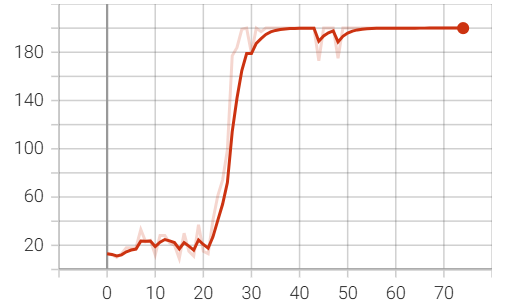
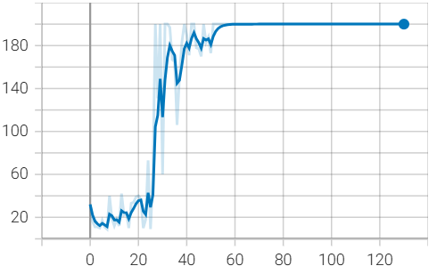

# 23336020 周子健 Week11 实验报告

## 一、实验题目

在 `CartPole-v0` 环境中实现DQN算法。

## 二、实验内容

### 1. 算法原理

+ Q-learning 算法：

  Q-learning 算法是一种 value-based 的强化学习算法，Q即为Q(s,a)，在某一时刻的state状态下，采取动作action能够获得收益的期望。
  
  主要思想是将state和action构建一张Q-table表存储Q值，然后根据Q值选取能够获得最大收益的动作。
  
  基于off-policy时序差分法，且使用贝尔曼方程可以对马尔科夫过程求解最优策略。

+ DQN 算法：

  DQN 算法将 Q-learning 算法和深度学习网络结合，并引入 **经验回放** 和 **目标网络**。

  1. **经验回放 (Replay Buffer)**：将智能体探索环境得到的数据储存起来，然后随机采样小批次样本更新深度神经网络的参数。

  2. **目标网络 (Target Network)**：额外引入一个目标网络（和Q网络具有同样的网络结构），此目标网络不更新梯度，每隔一段时间将Q网络的参数赋值给此目标网络。

### 2. 关键代码展示

#### Replay Buffer

`ReplayBuffer` 类使用 `deque` 实现：

+ `__init__` 创建一个固定大小的双端队列，当缓冲区满 (buffer_size) 满时，新数据会自动覆盖旧数据。

+ `push` 接受一个 `transition`（包含状态、动作、奖励、下一状态、完成标志）

+ `sample` 从缓冲区中随机采样指定数量 (batch_size) 的经验，按类比转换为 numpy 数组；其中，特别处理了 states 和 next_states，确保为二维数组。

代码如下：

```python
class ReplayBuffer:
    def __init__(self, buffer_size):
        self.buffer = deque(maxlen=buffer_size)

    def __len__(self):
        return len(self.buffer)

    def push(self, *transition):
        # transition: (state, action, reward, next_state, done)
        self.buffer.append(transition)

    def sample(self, batch_size):
        batch = random.sample(self.buffer, batch_size)
        states, actions, rewards, next_states, dones = zip(*batch)
        # 确保状态数组形状一致
        states = np.vstack(states)
        next_states = np.vstack(next_states)
        return states, np.array(actions), np.array(rewards, dtype=np.float32), \
            next_states, np.array(dones, dtype=np.uint8)

    def clean(self):
        self.buffer.clear()
```

#### Q Net

`QNerwork` 定义了一个具有两个隐藏层 (`fc_net - ReLU`) 的 MLP，隐藏层维度大小均为 64，用于近似 Q 函数。

```python
class QNetwork(nn.Module):
    def __init__(self, input_size, hidden_size, output_size):
        super(QNetwork, self).__init__()
        hidden_dims = [64, 64]
        layers = []
        self.fc_in = nn.Linear(input_size, hidden_dims[0])

        for i in range(len(hidden_dims)-1):
            layers.append(nn.Linear(hidden_dims[i], hidden_dims[i+1]))
            layers.append(nn.ReLU())

        self.fc_net = nn.Sequential(*layers)
        self.fc_final = nn.Linear(hidden_dims[-1], output_size)

    def forward(self, inputs):
        x = self.fc_in(inputs)
        x = self.fc_net(x)
        x = self.fc_final(x)
        return x
```

#### DQN Agent

`AgentDQN` 类实现了 DQN 算法的智能体类，继承自基础 `Agent` 类。

+ `__init__` 初始化了主网络 `q_network` 和目标网络 `target_network`，使用 Adam 优化器和 StepLR 学习率衰减调度器。

+ `make_action` 分为两种模式：测试模式 (`test=True`) 直接使用 Q-Net 选择 Q 值最高的网络；训练模式 (`test=False`) 使用 $\epsilon$-贪婪策略，以 `\epsilon` 的概率随机探索，否则选择最优策略。

+ `train` 首先从回放缓冲区采样经验 (batch_size)，然后计算当前 Q 值（使用 `q_network`）和目标 Q 值（使用 `target_network`）；计算 MSE loss 并反向传播；定期 (update_target_freq) 更新目标网络 `target_network`。

+ `run` 是主训练循环。每个 episode 首先创造新环境，在每个时间步中，首先使用 `make_action` 做出决策并更新状态，将经验添加到 Replay Buffer；然后训练网络一定次数，并逐步衰减 $\epsilon$ 和 learning rate。

> 由于代码较长，此处只贴部分代码

```python
class AgentDQN(Agent):
    def __init__(self, env, args):
        """
        Initialize every things you need here.
        For example: building your model
        """
        super(AgentDQN, self).__init__(env)
        self.env = env
        self.args = args
    
        self.q_network = QNetwork(self.state_dim, args.hidden_size, self.action_dim)
        self.target_network = QNetwork(self.state_dim, args.hidden_size, self.action_dim)
        self.target_network.load_state_dict(self.q_network.state_dict())
        
        # Initialize optimizer
        self.optimizer = optim.Adam(self.q_network.parameters(), lr=args.lr)
        self.scheduler = optim.lr_scheduler.StepLR(self.optimizer, step_size=50, gamma=0.1)

    def train(self):
        """
        Implement your training algorithm here
        """
        if len(self.replay_buffer) < self.batch_size:
            return
        
        # Sample from replay buffer
        states, actions, rewards, next_states, dones = self.replay_buffer.sample(self.batch_size)
        
        # Compute Q values
        current_q = self.q_network(states).gather(1, actions.unsqueeze(1))
        
        # Compute target Q values
        with torch.no_grad():
            next_q = self.target_network(next_states).max(1)[0]
            target_q = rewards + (1 - dones) * self.gamma * next_q
        
        # Compute loss and update
        loss = F.mse_loss(current_q.squeeze(), target_q)
        self.optimizer.zero_grad()
        loss.backward()
        nn.utils.clip_grad_norm_(self.q_network.parameters(), self.args.grad_norm_clip)
        self.optimizer.step()
        
        # Update target network
        if self.steps % self.update_target_freq == 0:
            self.target_network.load_state_dict(self.q_network.state_dict())
        
        return loss.item()

    def make_action(self, observation, test=True):
        # Epsilon-greedy policy during training
        if random.random() < self.epsilon:
            return self.env.action_space.sample()
        else:
            with torch.no_grad():
                state = torch.FloatTensor(observation).to(self.device).unsqueeze(0)
                q_values = self.q_network(state)
                action = q_values.max(1)[1].item()
            return action

    def run(self):
        print("Env max episode steps: ", self.env.spec.max_episode_steps)

        best_reward = -float('inf')
        
        for episode in range(self.args.n_frames):
            reset_result = self.env.reset()
            state = reset_result[0]  # 取第一个元素作为状态
            state = np.array(state, dtype=np.float32).flatten()
            self.init_game_setting()
            done = False
            episode_reward = 0
            
            while not done:
                # Select and perform action
                action = self.make_action(state, test=False)
                step_result = self.env.step(action)
                next_state, reward, terminated, truncated, _ = step_result
                done = terminated or truncated
                # Store transition in replay buffer
                self.replay_buffer.push(state, action, reward, next_state, done)
                
                # Train the network
                for _ in range(2):
                    loss = self.train()
                
                # Update state and reward
                state = next_state
                episode_reward += reward
                self.steps += 1
                
                # Decay epsilon
                self.epsilon = max(self.epsilon_min, self.epsilon * self.epsilon_decay)

                if done:
                    break

            # Update learning rate
            self.scheduler.step()    
```

### 3. 创新点 & 优化

+ 使用梯度裁切防止梯度爆炸：

  ```python
  # Compute loss and update
  loss = F.mse_loss(current_q.squeeze(), target_q)
  self.optimizer.zero_grad()
  loss.backward()
  nn.utils.clip_grad_norm_(self.q_network.parameters(), self.args.grad_norm_clip)
  self.optimizer.step()
  ```

+ 使用 StepLR 逐步衰减学习率，提高后期训练稳定性，促使收敛。

## 三、实验结果及分析

### 1. 实验结果展示示例

实际训练时，使用两种指标指示收敛，每种指标的超参数略有不同：

1. 50个episodes的平均reward达到195：StepLR-step_size=30(episodes)

2. 100个episodes的平均reward达到195：StepLR-step_size=50(episodes)

### 2. 评测指标展示及分析

对于指标一，50轮平均reward收敛到 195 以上使用了 **72 episodes**，图表如下：



对于指标二，100轮平均reward收敛到 195 以上使用了 **130 episodes**，图表如下：



## 四、参考资料

实验课件
